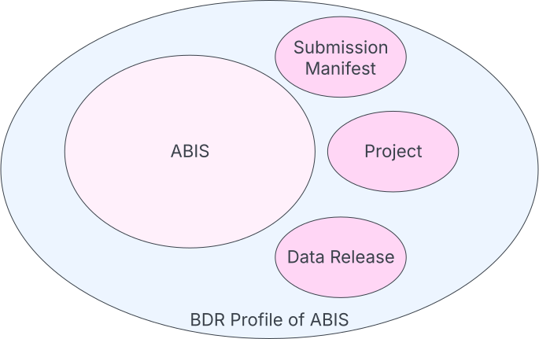

== Introduction

This document is the normative specification of the https://www.dcceew.gov.au/environment/environment-information-australia/biodiversity-data-repository[Biodiversity Data Repository (BDR)]'s _profile_ of the https://linked.data.gov.au/def/abis[Australian Biodiversity Information Standard (ABIS)].

The purpose of this profile is to define requirements of data that is to be sent to the BDR, above and beyond those already imposed by ABIS. ABIS essentially defines the scientific information within data set to the BDR but does not define how to package that data, when it can be made available and so on. That is covered by this Profile.

[NOTE]
----
ABIS may be used for data representation and data exchange with no reference to this this Profile _if there is to be no involvement with the BDR._ For example, it is perfectly acceptable for companies to exchange ABIS data amongst themselves.

However, this Profile is freely available for any use so anyone may use this Profile to represent and excahnge data if they wish.
----

The figure below, which is the same as the one at the start of this document, shows the envelope of this Profile with ABIS and the other models within it. See https://linked.data.gov.au/def/abis#_models[ABIS' Models Section] for the details of the various models inside ABIS and the models that ABIS, in turn, profiles.

[#intro-models-overview,link="img/models-overview.svg"]
.Models within the Profile. Contained are ABIS - for scientific content - and Submissions Manifest, Project and Data Release models for data management within the BDR.

=== Multiple Models

This Profile is centered on ABIS but includes several models not found within ABIS that have been developed specifically for data management within the BDR. These models - the Submissions Manifest, Project and Data Release models as shown in the figure above - are themselves mini-profiles of other, standard, models in that they mostly reuse classes and predicates from rather than inventing new ones.

The "Background Models" that these models inherit from and themselves profile are also the background models of ABIS - this Profile introduces no new ones. You can see the full list of ABIS', and therefore this Profile's, background models at:

* https://linked.data.gov.au/def/abis#_background_models[ABIS' Background Models]

Since ABIS is well describes in the https://linked.data.gov.au/def/abis[ABIS Specification], it will not be re-described in this Profile document. The <<Models, following Models section>> described each of the other models within this Profile.

=== Governance

This Profile is goverend by the BDR Team - the team that also operates the BDR.

ABIS is managed day-to-day by the Department of Climate Change, Energy, the Environment and Water (https://linked.data.gov.au/org/dcceew[DCCEEW]) however many parts of ABIS are maintained externally, such as the <<TERNOntology, TERN Ontology>> which is maintained by https://linked.data.gov.au/org/tern[TERN] and ABIS as a whole is governance by https://linked.data.gov.au/org/ausbigg[AusBIGG], the Australian Biodiversity Information Governance Group, which comprises DCCEEW, State & Territory biodiversity data holders and other organisations in the sector, such as TERN.

Use of this Profile will always require use of ABIS and no changes will be introduced to this profile that conflict with ABIS.

An Issue Tracker for this document and for any other aspects of ABIS is public and online at: https://github.com/AusBIGG/abis/issues. Anyone with an interest in ABIS is invited to submit Issues there to be considered by ABIS management & governance parties.

=== Related Standards

ABIS comprises multiple models and some of them inherit from other models and standards. See the <<Models, Models>> section for details.

Additionally, ABIS exists within a domain that already contains many international and national standards and well-known models. The <<Mappings, Mappings>> section described how ABIS relates to many of them.

=== Structure

This specification aims to cover all the information needed to understand ABIS and use it. The following is a list of the major sections in this document and their purposes.

[start=4]
. <<Introduction, Introduction>>
** This section. An informal overview of ABIS
. <<Patterns, Patterns>>
** Descriptions of important modelling choices made in ABIS and the models it inherits from
. <<Models, Models>>
** The normative description of the data models used within ABIS
. <<Vocabularies, Vocabularies>>
** Description of, and links to, the vocabularies needed for use with ABIS
. <<Profiles, Profiles>>
** A listing of known profiles of ABIS
. <<Validation, Validation>>
** How to validate data according to ABIS and links to the various validators
. <<Mappings, Mappings>>
** Human- and machine-readable mappings between ABIS and other standards within ABIS' domain
. <<Reasoning Rules, Reasoning Rules>>
** Machine-executable rules that can be applied to ABIS data to infer further information

Two additional models - extensions to ABIS - are defined in this document:

* <<annex-b, Annex A: Projects Model>>
* <<annex-c, Annex B: Data Release Model>>

Extended examples <<TERNOntology, TERN Ontology>> data, in use within ABIS, are given in <<annex-d, Annex C>>.
