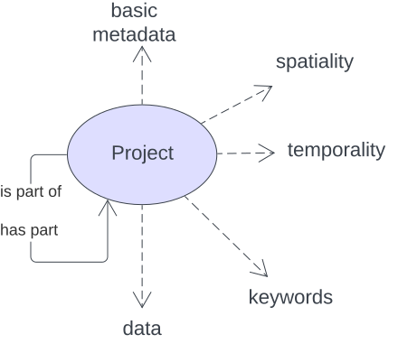
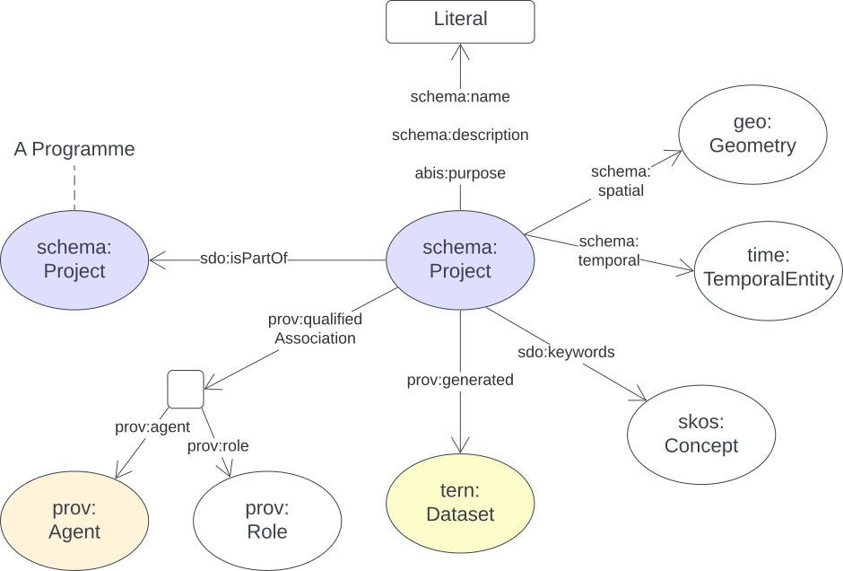

[[annex-a]]
== Annex A: BDR Project Model

[#proj-overview,link="img/annex-a/overview.svg"]
.Overview of the Project Model: A Project can be part of another Project or have as parts other Projects and can have basic metadata (name, related agents etc.), spatial, temporality and keywords associated with it

<<schema:Project, `Project`>>s can be part of larger projects are a specialised form of the <<PROV, Provenance Ontology>>'s https://www.w3.org/TR/prov-o/#Activity[`Activity`] class which is just a general temporal event. `Activity` instances, typically produce things and `Project` instances, in the context of the BDR, are expected to produce data held by the BDR.

`Project` instances can be part of larger `Project` instances which may be termed "Programmes".

`Project` instances can have simple metadata, such as names, descriptions, related agents and so on.

Also, as per PROV, some information about an `Entity` (data), produced by an `Activity`, can be inferred from the `Activity`, for example, the _funder_ of a `Project` can be assumed to have funded (the production of) a `Dataset` it produced and the spatial area of the `Project` must surely contain the spatial area of the `Dataset`.

[[projects-metadata]]
=== A.1 Metadata

[frame=none, grid=none, cols="1,5"]
|===
|*<<IRI, IRI>>* | https://linked.data.gov.au/def/bdr-pr/proj
|*https://schema.org/name[Name]* | BDR Project Model
|*https://www.w3.org/TR/skos-reference/#definition[Definition]* | This model is for describing Projects where Project is defined as "An Activity that requires concerted effort following a Plan in pursuit of an objective".
|*https://schema.org/dateCreated[Created Date]* | 2023-10-15
|*https://schema.org/dateModified[Modified Date]* | 2023-04-30
|*https://schema.org/dateIssued[Issued Date]* | 2025-04-30
|*https://schema.org/version[Version]* | 2.1
|*https://www.w3.org/TR/2012/REC-owl2-syntax-20121211/#Ontology_IRI_and_Version_IRI[Version IRI]* | https://linked.data.gov.au/def/bdr-proj/2.0[proj:2.0]
|*https://www.w3.org/TR/skos-reference/#historyNote[Version History]*| *2.1* - 2025 April - simplification to use schema.org Project

2.0 - 2023 Dec - First release (v2.0 to match ABIS)
|*https://schema.org/creator[Creator]* | https://linked.data.gov.au/org/dcceew[Department of Climate Change, Energy and the Environment (DCCEEW)]
|*https://schema.org/owner[Owner]* | https://linked.data.gov.au/org/dcceew[DCCEEW]
|*https://schema.org/publisher[Publisher]* | https://linked.data.gov.au/org/dcceew[DCCEEW]
|*https://schema.org/license[License]* | https://creativecommons.org/licenses/by/4.0/[Creative Commons Attribution 4.0 International (CC BY 4.0)]
|*https://www.w3.org/TR/vocab-dcat/#Property:resource_contact_point[Contacts]* | The BDR Team on bdr@dcceew.gov.au +

Issue tracking for this profile is managed online at https://github.com/dcceew-bdr/bdr-profile-of-abis/issues
|*https://schema.org/codeRepository[Code Repository]* | https://github.com/dcceew-bdr/bdr-profile-of-abis
|===

=== A.2 Supporting Assets

* RDF schema:
** https://linked.data.gov.au/def/bdr-pr/proj.ttl
* <<SHACL, SHACL>> validation file:
** https://linked.data.gov.au/def/bdr-proj/validator.ttl

=== A.3 Classes

[discrete]
==== A.3.1 Class Index

Classes defined elsewhere:

* <<schema:Project, Project>>
* <<prov:Agent, Agent>>
* <<tern:Dataset, Dataset>>
* <<skos:Concept, Concept>>

[discrete]
[[schema:Project]]
==== A.3.2 Project

[#proj-project,link="img/annex-a/project-class-eg.svg"]
.The Projects Model `Project` Class and its main relations

[cols="3,10"]
|===
| Property | Value

| <<IRI, IRI>> | `schema:Project`
| https://www.w3.org/TR/rdf12-schema/#ch_subclassof[Subclass of] | https://www.w3.org/TR/prov-o/#Activity[`Activity`]
| https://www.w3.org/TR/rdf12-schema/#ch_isdefinedby[Is Defined By] | <<SDO, schema.org>>
| https://www.w3.org/TR/skos-reference/#prefLabel[Preferred Label] | Project
| https://www.w3.org/TR/skos-reference/#definition[Definition] | An enterprise (potentially individual but typically collaborative), planned to achieve a particular aim
| https://www.w3.org/TR/skos-reference/#definition[History Note] | Taken directly from schema.org
| Expected Properties | <<schema:isPartOf, is part of>>, basic metadata predicates, <<schema:spatial, spatial>>, <<schema:temporality, temporality>>, <<schema:keywords, keywords>>, <<prov:generated, generated>>, <<prov:qualifiedAttribution, qualified attribution>>,
| https://www.w3.org/TR/skos-reference/#example[Example]
a|
[,turtle]
----
include::examples/annex-a/project-class-eg.ttl[]
----
|===

[discrete]
[[prov:Agent]]
==== A.3.5 Agent

[cols="3,10"]
|===
| Property | Value

| <<IRI, IRI>> | `prov:Agent`
| https://www.w3.org/TR/skos-reference/#prefLabel[Preferred Label] | Agent
| https://www.w3.org/TR/skos-reference/#definition[Definition] | Something that bears some form of responsibility for an activity taking place
| https://www.w3.org/TR/skos-reference/#scopeNote[Scope Note] | Use specialised objects of this class - Organisation or Person - that bear some form of responsibility for a <<schema:Project, Project>> where their role is qualified within an https://www.w3.org/TR/prov-o/#Attribution[`prov:Attribution`]. <<SDO, schema.org>>'s `https://schema.org/Person[Person]` & `https://schema.org/Organization[Organization]` specialised forms of `Agent` are expected to be used.
| https://www.w3.org/TR/rdf12-schema/#ch_isdefinedby[Is Defined By] | <<PROV, PROV>>
| Expected Properties | None: use the Agent's identifier only
| https://www.w3.org/TR/skos-reference/#example[Example] | _See the Example for <<schema:Project, Project>>_
|===

[discrete]
[[tern:Dataset]]
==== A.3.8 Dataset

[cols="3,10"]
|===
| Property | Value

| <<IRI, IRI>> | `skos:Concept`
| https://www.w3.org/TR/skos-reference/#prefLabel[Preferred Label] | Dataset
| https://www.w3.org/TR/rdf12-schema/#ch_subclassof[Subclass of] | https://www.w3.org/TR/prov-o/#Entity[`Entity`]
| https://www.w3.org/TR/skos-reference/#definition[Definition] | A collection of data, published or curated by a single agent, and available for access or download in one or more representations.
| https://www.w3.org/TR/skos-reference/#scopeNote[Scope Note] | Used for the outputs of a Project
| https://www.w3.org/TR/rdf12-schema/#ch_isdefinedby[Is Defined By] | <<TERNOntology, TERN Ontology>>
| Expected Properties | None for this model: all properties are concerns of <<ABIS, ABIS>>
| https://www.w3.org/TR/skos-reference/#example[Example] | _See the Example for <<schema:Project, Project>>_
|===

[discrete]
[[skos:Concept]]
==== A.3.8 Concept

[cols="3,10"]
|===
| Property | Value

| <<IRI, IRI>> | `skos:Concept`
| https://www.w3.org/TR/skos-reference/#prefLabel[Preferred Label] | Concept
| https://www.w3.org/TR/skos-reference/#definition[Definition] | An idea or notion; a unit of thought
| https://www.w3.org/TR/skos-reference/#scopeNote[Scope Note] | Direct use of this Class is not expected, instead where a `Concept` is indicated for use, a specific concept from a controlled vocabulary is expected to be used.
| https://www.w3.org/TR/rdf12-schema/#ch_isdefinedby[Is Defined By] | <<SKOS, SKOS>>
| Expected Properties | None - all properties should be stored within the vocab the Concept comes from
| https://www.w3.org/TR/skos-reference/#example[Example] | _See the Example for <<schema:Project, Project>>_
|===

=== A.4 Predicates

This model defines only one predicate - <<abis:purpose, purpose>> - but also requires the use of others defined elsewhere. Definitions for all predicates are copied from source and given here.

[discrete]
==== Predicate Index

Predicates defined elsewhere:

* <<schema:name, name>>
* <<schema:description, description>>
* <<abis:purpose, purpose>>
* <<schema:keywords, keywords>>
* <<schema:hasPart, has part>>
* <<schema:isPartOf, is part of>>
* <<schema:spatial, spatial>>
* <<schema:temporality, temporality>>
* <<prov:qualifiedAttribution, qualified attribution>>
* <<prov:agent, agent>>
* <<prov:hadRole, had role>>
* <<prov:generated, generated>>

[discrete]
[[abis:purpose]]
==== purpose

[cols="3,10"]
|===
| Property | Value

| <<IRI, IRI>> | `abis:purpose`
| https://www.w3.org/TR/skos-reference/#prefLabel[Preferred Label] | purpose
| https://www.w3.org/TR/skos-reference/#definition[Definition] | The intent of the Activity
| https://www.w3.org/TR/skos-reference/#scopeNote[Scope Note] | Use this predicate to indicate a textual intent for a Project or a Program
| https://www.w3.org/TR/rdf12-schema/#ch_isdefinedby[Is Defined By] | This model
| https://www.w3.org/TR/skos-reference/#example[Example] | _See the example for <<schema:Project, Project>>_
|===

[discrete]
[[schema:name]]
==== name

[cols="3,10"]
|===
| Property | Value

| <<IRI, IRI>> | `schema:name`
| https://www.w3.org/TR/skos-reference/#prefLabel[Preferred Label] | name
| https://www.w3.org/TR/skos-reference/#definition[Definition] | The name of the item
| https://www.w3.org/TR/skos-reference/#scopeNote[Scope Note] | Use this predicate to indicate a textual name for something
| https://www.w3.org/TR/rdf12-schema/#ch_isdefinedby[Is Defined By] | <<SDO, SDO>>
| https://www.w3.org/TR/skos-reference/#example[Example] | _See the example for <<schema:Project, Project>>_
|===

[discrete]
[[schema:description]]
==== description

[cols="3,10"]
|===
| Property | Value

| <<IRI, IRI>> | `schema:description`
| https://www.w3.org/TR/skos-reference/#prefLabel[Preferred Label] | description
| https://www.w3.org/TR/skos-reference/#definition[Definition] | A description of the item
| https://www.w3.org/TR/skos-reference/#scopeNote[Scope Note] | Use this predicate to indicate a textual description for something
| https://www.w3.org/TR/rdf12-schema/#ch_isdefinedby[Is Defined By] | <<SDO, SDO>>
| https://www.w3.org/TR/skos-reference/#example[Example] | _See the example for <<schema:Project, Project>>_
|===

[discrete]
[[schema:keywords]]
==== keywords

[cols="3,10"]
|===
| Property | Value

| <<IRI, IRI>> | `schema:keywords`
| https://www.w3.org/TR/skos-reference/#prefLabel[Preferred Label] | keywords
| https://www.w3.org/TR/skos-reference/#definition[Definition] | Keywords or tags used to describe some item
| https://www.w3.org/TR/skos-reference/#scopeNote[Scope Note] | Use this predicate to indicate <<skos:Concept, Concept>> instances from controlled vocabularies to categorise the object this predicate is applied to
| https://www.w3.org/TR/rdf12-schema/#ch_isdefinedby[Is Defined By] | <<SDO, SDO>>
| https://www.w3.org/TR/skos-reference/#example[Example] a| See the Example for <<schema:Project, Project>>
|===

[discrete]
[[schema:hasPart]]
==== has part

[cols="3,10"]
|===
| Property | Value

| <<IRI, IRI>> | `schema:hasPart`
| https://www.w3.org/TR/skos-reference/#prefLabel[Preferred Label] | has part
| https://www.w3.org/TR/skos-reference/#definition[Definition] | Indicates an item is part of this item
| Inverse of | <<schema:isPartOf, is part of>>
| https://www.w3.org/TR/skos-reference/#scopeNote[Scope Note] | Use this predicate to indicate that a <<schema:Project, Project>> includes another <<schema:Project, Project>>
| https://www.w3.org/TR/rdf12-schema/#ch_isdefinedby[Is Defined By] | <<SDO, SDO>>
| https://www.w3.org/TR/skos-reference/#example[Example] | _See the example for <<schema:Project, Project>>_
|===

[discrete]
[[schema:isPartOf]]
==== is part of

[cols="3,10"]
|===
| Property | Value

| <<IRI, IRI>> | `schema:isPartOf`
| https://www.w3.org/TR/skos-reference/#prefLabel[Preferred Label] | is part of
| https://www.w3.org/TR/skos-reference/#definition[Definition] | Indicates an item that this item, in some sense, is part of
| Inverse of | <<schema:hasPart, has part>>
| https://www.w3.org/TR/skos-reference/#scopeNote[Scope Note] | Use this predicate to indicate that a <<schema:Project, Project>> is included within another <<schema:Project, Project>>
| https://www.w3.org/TR/rdf12-schema/#ch_isdefinedby[Is Defined By] | <<SDO, SDO>>
| https://www.w3.org/TR/skos-reference/#example[Example] | _See the example for <<schema:Project, Project>>_
|===

[discrete]
[[schema:spatial]]
==== spatial

[cols="3,10"]
|===
| Property | Value

| <<IRI, IRI>> | `schema:spatial`
| https://www.w3.org/TR/skos-reference/#prefLabel[Preferred Label] | spatial
| https://www.w3.org/TR/skos-reference/#definition[Definition] | Spatial coverage
| https://www.w3.org/TR/skos-reference/#scopeNote[Scope Note] | Use this predicate to indicate that a <<schema:Project, Project>> has a spatial area of concern
| https://www.w3.org/TR/rdf12-schema/#ch_isdefinedby[Is Defined By] | <<SDO, schema.org>>
| https://www.w3.org/TR/rdf11-schema/#ch_range[Range] | https://opengeospatial.github.io/ogc-geosparql/geosparql11/spec.html#_geometry_class[`Geometry`]
| https://www.w3.org/TR/skos-reference/#example[Example] | _See the example for <<schema:Project, Project>>_
|===

[discrete]
[[schema:temporality]]
==== temporality

[cols="3,10"]
|===
| Property | Value

| <<IRI, IRI>> | `schema:temporality`
| https://www.w3.org/TR/skos-reference/#prefLabel[Preferred Label] | temporality
| https://www.w3.org/TR/skos-reference/#definition[Definition] | Temporal coverage
| https://www.w3.org/TR/skos-reference/#scopeNote[Scope Note] | Use this predicate to indicate that a <<schema:Project, Project>> has a temporal region of concern
| https://www.w3.org/TR/rdf12-schema/#ch_isdefinedby[Is Defined By] | <<SDO, schema.org>>
| https://www.w3.org/TR/rdf11-schema/#ch_range[Range] | https://www.w3.org/TR/owl-time/#time:TemporalEntity[`time:TemporalEntity`]
| https://www.w3.org/TR/skos-reference/#example[Example] | _See the example for <<schema:Project, Project>>_
|===

[discrete]
[[prov:qualifiedAttribution]]
==== qualified attribution

[cols="3,10"]
|===
| Property | Value

| <<IRI, IRI>> | `prov:qualifiedAttribution`
| https://www.w3.org/TR/skos-reference/#prefLabel[Preferred Label] | qualified attribution
| https://www.w3.org/TR/skos-reference/#definition[Definition] | The ascribing of an entity to an agent
| https://www.w3.org/TR/skos-reference/#scopeNote[Scope Note] | Use this predicate to link a <<schema:Project, Project>> to a https://www.w3.org/TR/prov-o/#Attribution[`prov:Attribution`] which then links to an <<prov:Agent, Agent>> with a https://www.w3.org/TR/prov-o/#Role[`prov:Role`]
| https://www.w3.org/TR/rdf12-schema/#ch_isdefinedby[Is Defined By] | <<PROV, PROV>>
| https://www.w3.org/TR/rdf11-schema/#ch_range[Range] | https://www.w3.org/TR/prov-o/#Attribution[`prov:Attribution`]
| https://www.w3.org/TR/skos-reference/#example[Example] | _See the example for <<schema:Project, Project>>_
|===

[discrete]
[[prov:agent]]
==== agent

[cols="3,10"]
|===
| Property | Value

| <<IRI, IRI>> | `prov:agent`
| https://www.w3.org/TR/skos-reference/#prefLabel[Preferred Label] | agent
| https://www.w3.org/TR/skos-reference/#definition[Definition] | References an <<prov:Agent, Agent>> which influenced a resource
| https://www.w3.org/TR/skos-reference/#scopeNote[Scope Note] | Use this predicate to link an https://www.w3.org/TR/prov-o/#Attribution[`prov:Attribution`] to an <<prov:Agent, Agent>>
| https://www.w3.org/TR/rdf12-schema/#ch_isdefinedby[Is Defined By] | <<PROV, PROV>>
| https://www.w3.org/TR/skos-reference/#example[Example] | _See the example for <<schema:Project, Project>>_
|===

[discrete]
[[prov:hadRole]]
==== had role

[cols="3,10"]
|===
| Property | Value

| <<IRI, IRI>> | `prov:hadRole`
| https://www.w3.org/TR/skos-reference/#prefLabel[Preferred Label] | had role
| https://www.w3.org/TR/skos-reference/#definition[Definition] | A role is the function of an entity or agent with respect to an activity
| https://www.w3.org/TR/skos-reference/#scopeNote[Scope Note] | Use this predicate to link an https://www.w3.org/TR/prov-o/#Attribution[`prov:Attribution`] to an https://www.w3.org/TR/prov-o/#Role[`prov:Role`]
| https://www.w3.org/TR/rdf12-schema/#ch_isdefinedby[Is Defined By] | <<PROV, PROV>>
| https://www.w3.org/TR/skos-reference/#example[Example] | _See the example for <<schema:Project, Project>>_
|===

[discrete]
[[prov:generated]]
==== generated

[cols="3,10"]
|===
| Property | Value

| <<IRI, IRI>> | `prov:generated`
| https://www.w3.org/TR/skos-reference/#prefLabel[Preferred Label] | generated
| https://www.w3.org/TR/skos-reference/#definition[Definition] | Generation is the completion of production of a new entity by an activity
| https://www.w3.org/TR/skos-reference/#scopeNote[Scope Note] | Use this predicate to link a <<schema:Project, Project>> to data that it produced, in the form of a https://w3id.org/tern/ontologies/tern/Dataset[`tern:Dataset`] containing ABIS data
| https://www.w3.org/TR/rdf12-schema/#ch_isdefinedby[Is Defined By] | <<PROV, PROV>>
| https://www.w3.org/TR/skos-reference/#example[Example] | _See the example for <<schema:Project, Project>>_
|===

=== A.5 Validator

The validator for this model is linked to in the <<C.2 Supporting Assets, C.2 Supporting Assets>> section above.

This validator should be used in conjunction with the main validator for the BDR profile of ABIS which is available in the <<Validation, Validation>> section above.

See the <<Validation, Validation>> section above also for information about how to perform validation.

[discrete]
==== Shapes Index

* <<#idn-roles, IDN Roles>>

#INCOMPLETE#

[discrete]
[[idn-roles]]
==== IDN Roles

[cols="3,10"]
|===
| Property | Value

| <<IRI, IRI>> | `abis:idn-roles`
| https://www.w3.org/TR/skos-reference/#prefLabel[Preferred Label] | IDN Roles
| https://www.w3.org/TR/skos-reference/#definition[Definition] | Roles for the predicate `prov:role` on instances of https://www.w3.org/TR/prov-o/#Attribution[`prov:Attribution`] linked to an `schema:Project` must be taken from the https://data.idnau.org/pid/vocab/idn-role-codes[IDN Role Codes Vocabulary]
| https://www.w3.org/TR/rdf12-schema/#ch_isdefinedby[Is Defined By] | This model's validator
| Code a|
----
abis:idn-roles
    a shacl:Shape ;
    schema:name "IDN Roles" ;
    schema:description "Roles for the predicate prov:role on instances of prov:Attribution linked to an schema:Project must be taken from the IDN Role Codes Vocabulary (https://data.idnau.org/pid/vocab/idn-role-codes)" ;
    sh:path [

    ] ;
.
----
|===

#INCOMPLETE#