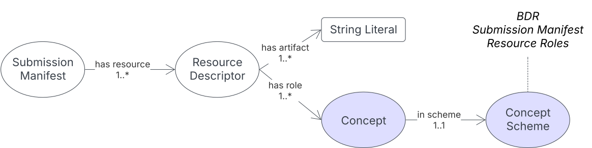

[[annex-c]]
== Annex C: BDR Submission Manifest Model

[#sub-man-model,link="img/sub-man-model.svg"]
.An overview of the BDR Submission Manifest Model

This model is for a _manifest_ - a listing of contents - of data submissions to the <<BDR>>. The manifests are supplied as <<RDF, RDF>> files containing information according to this model within all data submissions to the BDR. The manifest information provides location, role and other information about all the data resources, allowing the BDR to process them correctly and efficiently.

=== C.1 Metadata

[frame=none, grid=none, cols="1,5"]
|===
|*<<IRI, IRI>>* | https://linked.data.gov.au/def/bdr-pr/sm
|*https://schema.org/name[Name]* | BDR Submission Manifest Model
|*https://www.w3.org/TR/skos-reference/#definition[Definition]* | This model is for a _manifest_ - a listing of contents - of data submissions to the <<BDR>>
|*https://schema.org/dateCreated[Created Date]* | 2205-02-15
|*https://schema.org/dateModified[Modified Date]* | 2025-04-29
|*https://schema.org/dateIssued[Issued Date]* | 2025-03-01
|*https://schema.org/version[Version]* | 1.0
|*https://www.w3.org/TR/2012/REC-owl2-syntax-20121211/#Ontology_IRI_and_Version_IRI[Version IRI]* | https://linked.data.gov.au/def/bdr-pr/sm/2.0[sm:2.0]
|*https://www.w3.org/TR/skos-reference/#historyNote[Version History]*| *1.0* - 2025 Mar - First release
|*https://schema.org/creator[Creator]* | https://linked.data.gov.au/org/dcceew[Department of Climate Change, Energy and the Environment (DCCEEW)]
|*https://schema.org/owner[Owner]* | https://linked.data.gov.au/org/ausbigg[DCCEEW]
|*https://schema.org/publisher[Publisher]* | https://linked.data.gov.au/org/dcceew[DCCEEW]
|*https://schema.org/license[License]* | https://creativecommons.org/licenses/by/4.0/[Creative Commons Attribution 4.0 International (CC BY 4.0)]
|*https://www.w3.org/TR/vocab-dcat/#Property:resource_contact_point[Contacts]* | The BDR Team on bdr@dcceew.gov.au +

Issue tracking for this profile is managed online at https://github.com/dcceew-bdr/bdr-profile-of-abis/issues
|*https://schema.org/codeRepository[Code Repository]* | https://github.com/dcceew-bdr/bdr-profile-of-abis
|===

=== C.2 Supporting Assets

* RDF schema:
** https://linked.data.gov.au/def/bdr-pr/sm.ttl
* <<SHACL, SHACL>> validation file:
** https://linked.data.gov.au/def/bdr-pr/sm/validator.ttl
* Submission Manifest Model Resource Roles vocabulary:
** https://linked.data.gov.au/def/bdr-pr/smrr
** RDF file: https://linked.data.gov.au/def/bdr-pr/smrr.ttl

=== C.3 Classes

[discrete]
==== C.3.1 Class Index

Classes defined here:

* <<sm:SubmissionManifest, Submission Manifest>>

Classes defined elsewhere:

* <<prof:ResourceDescriptor, Resource Descriptor>>

[discrete]
[[sm:SubmissionManifest]]
==== C.3.2 Submission Manifest

[cols="3,10"]
|===
| Property | Value

| <<IRI, IRI>> | `sm:SubmissionManifest`
| https://www.w3.org/TR/rdf12-schema/#ch_isdefinedby[Is Defined By] | This model
| https://www.w3.org/TR/skos-reference/#prefLabel[Preferred Label] | Submission Manifest
| https://www.w3.org/TR/skos-reference/#definition[Definition] | A listing of the content of a data submission to the BDR
| https://www.w3.org/TR/skos-reference/#definition[History Note] | Defined by BDR Team in 2025 to assist with the accurate and efficient processing of data submissions to the BDR
| Expected Properties | <<prof:hasResource, has resource>>
| https://www.w3.org/TR/skos-reference/#example[Example]
a|
[,turtle]
----
include::examples/annex-c/submission-classes.ttl[]
----
|===

[discrete]
[[prof:ResourceDescriptor]]
==== C.3.3 Resource Descriptor

[cols="3,10"]
|===
| Property | Value

| <<IRI, IRI>> | `prof:ResourceDescriptor`
| https://www.w3.org/TR/rdf12-schema/#ch_isdefinedby[Is Defined By] | <<PROF, The Profiles Vocabulary>>
| https://www.w3.org/TR/skos-reference/#prefLabel[Preferred Label] | Resource Descriptor
| https://www.w3.org/TR/skos-reference/#definition[Definition] | A resource that defines an aspect - a particular part or feature - of a Profile
| https://www.w3.org/TR/skos-reference/#definition[History Note] | Defined in <<PROF, PROF>> and reused directly in this model
| Expected Properties | <<prof:hasArtifact, has artifact>>, <<prof:hasRole, has role>>
| https://www.w3.org/TR/skos-reference/#scopeNote[Scope Note] | Treat the Submission Manifest as the Profile this class is related to
| https://www.w3.org/TR/skos-reference/#example[Example] | _See the example for <<sm:SubmissionManifest, Submission Manifest>>_
|===

=== C.4 Predicates

[discrete]
==== C.4.1 Predicate Index

Predicates defined elsewhere:

* <<prof:hasResource, has resource>>
* <<prof:hasArtifact, has artifact>>
* <<prof:hasRole, has role>>
* <<skos:inScheme, in scheme>>

[discrete]
[[prof:hasResource]]
==== C.4.2 has resource

[cols="1,5"]
|===
| Property | Value

| <<IRI, IRI>> | `prof:hasResource`
| https://www.w3.org/TR/skos-reference/#prefLabel[Preferred Label] | has resource
| https://www.w3.org/TR/skos-reference/#definition[Definition] | A resource which describes the nature of an artifact and the role it plays in relation to the Profile
| https://www.w3.org/TR/skos-reference/#definition[History Note] | Defined in <<PROF, PROF>> and reused directly in this model
| https://www.w3.org/TR/rdf12-schema/#ch_range[Range] | <<prof:ResourceDescriptor, Resource Descriptor>>
| https://www.w3.org/TR/skos-reference/#scopeNote[Scope Note] | Treat the Submission Manifest as the Profile this predicate requires
| https://www.w3.org/TR/skos-reference/#example[Example] | _See the example for <<sm:SubmissionManifest, Submission Manifest>>_
|===

[discrete]
[[prof:hasArtifact]]
==== C.4.3 has artifact

[cols="1,5"]
|===
| Property | Value

| <<IRI, IRI>> | `prof:hasArtifact`
| https://www.w3.org/TR/skos-reference/#prefLabel[Preferred Label] | has artifact
| https://www.w3.org/TR/skos-reference/#definition[Definition] | The URL of a file with particulars such as its format and role indicated by the Resource Descriptor
| https://www.w3.org/TR/skos-reference/#definition[History Note] | Defined in <<PROF, PROF>> and reused directly in this model
| https://www.w3.org/TR/rdf12-schema/#ch_domain[Domain] | <<prof:ResourceDescriptor, Resource Descriptor>>
| https://www.w3.org/TR/skos-reference/#scopeNote[Scope Note] | Can be used to indicate multiple files by file paths
| https://www.w3.org/TR/skos-reference/#example[Example] | _See the example for <<sm:SubmissionManifest, Submission Manifest>>_
|===

[discrete]
[[prof:hasRole]]
==== C.4.4 has role

[cols="1,5"]
|===
| Property | Value

| <<IRI, IRI>> | `prof:hasRole`
| https://www.w3.org/TR/skos-reference/#prefLabel[Preferred Label] | has role
| https://www.w3.org/TR/skos-reference/#definition[Definition] | A description of a resource that defines an aspect - a particular part, feature or role - of a Profile
| https://www.w3.org/TR/skos-reference/#definition[History Note] | Defined in <<PROF, PROF>> and reused directly in this model
| https://www.w3.org/TR/rdf12-schema/#ch_domain[Domain] | <<prof:ResourceDescriptor, Resource Descriptor>>
| https://www.w3.org/TR/skos-reference/#scopeNote[Scope Note] | Must be used to indicate a role from the https://linked.data.gov.au/def/bdr-pr/smrr[Submission Manifest Model Resource Roles Vocabulary]
| https://www.w3.org/TR/skos-reference/#example[Example] | _See the example for <<sm:SubmissionManifest, Submission Manifest>>_
|===

[discrete]
[[skos:inScheme]]
==== C.4.5 in scheme

[cols="1,5"]
|===
| Property | Value

| <<IRI, IRI>> | `skos:inScheme`
| https://www.w3.org/TR/skos-reference/#prefLabel[Preferred Label] | in scheme
| https://www.w3.org/TR/skos-reference/#definition[Definition] | is in scheme
| https://www.w3.org/TR/skos-reference/#definition[History Note] | Defined in <<SKOS, SKOS>> and reused directly in this model
| https://www.w3.org/TR/rdf12-schema/#ch_domain[Domain] | <<prof:ResourceDescriptor, Resource Descriptor>>
| https://www.w3.org/TR/skos-reference/#scopeNote[Scope Note] | Must be used to indicate that a role used as the value for the <<prof:hasRole, has role>> predicate is within the https://linked.data.gov.au/def/bdr-pr/smrr[Submission Manifest Model Resource Roles Vocabulary]
| https://www.w3.org/TR/skos-reference/#example[Example] | _See the example for <<sm:SubmissionManifest, Submission Manifest>>_
|===

=== C.5 Validator

The validator for this model is linked to in the <<C.2 Supporting Assets, C.2 Supporting Assets>> section above.

This validator only validates manifest content, not the content of the data that the manifest lists - BDR/ABIS data.

=== C.6 Vocabularies

==== BDR Submission Manifest Resource Roles

This model depends on the https://linked.data.gov.au/def/bdr-pr/smrr[Submission Manifest Model Resource Roles Vocabulary] which is linked to in the <<C.2 Supporting Assets, C.2 Supporting Assets>> section above.

Concepts from this vocabulary MUST be used as values for the <<prof:hasRole, has role>> predicate.

=== C.7 Examples

==== C.7.1 MONITOR single

A single RDF file submission from the TERN MONITOR application.

This is a single RDF file - `plant-tissue-lite-protocol-org-uuid-0fb52b7b-29f1-4797-920a-9c88f2180c5e-start-date-2024-12-11T06_53_43.879Z.ttl` - sent from the MONITOR system to the BDR with no additional submission resources, such as image files.

[,turtle]
----
include::examples/annex-c/monitor-simple/submission.ttl[]
----

The manifest above points to the single data file and indicates that its Submission Manifest Resource Role is `SufficientForValidation` meaning this single data file can be validated as-is.

==== C.7.2 MONITOR multi

A multiple file submission from the TERN MONITOR application that includes both an RDF data file and also a number of image files.

[,turtle]
----
include::examples/annex-c/monitor-multi/submission.ttl[]
----

The images are indicated as having a role of `SupplimentaryData` meaning they will be handled in some way (stored) but not validated using ABIS validators. These image files must be linked to from within the submitted data.

==== C.7.3 Gaia archival

A submission from Gaia Resources with multiple RDF files and archival content.

[,turtle]
----
include::examples/annex-c/gaia-archives/submission.ttl[]
----

The survey- and dataset-level metadata stored in the files `dataset.ttl` and `survey-metadata.ttl` has the role `NecessaryForValidation` meaning it must be loaded for other resources to be validated but it is not itself directly validates. This is because it will likely be invalid: it's metadata only and docesn't include the actual core TERN Ontology observations data.

The second resource indicates a number of "chunk" files in a directory, each with the role `IsolatedContent` which means each can be validated in isolation from any other, but must have had the resource with role `NecessaryForValidation` loaded first - the required Dataset & Survey metadata.

The last resource is a set of files in a directory with the role `SubmissionSourceArchive` meaning it's all to be archived - stored in the BDR's provisioned archival storage unit - and not validated. These resources must be linked to from within the submitted data.